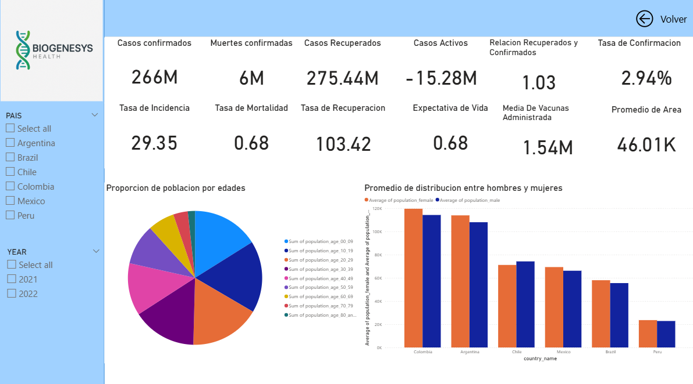

🌎 Estrategia de Expansión Regional para BioGenesys en América Latina
Proyecto Final – Módulo 4 | Data Analytics – Henry
Para ver el .pbix: https://drive.google.com/drive/u/0/folders/1aOqjg50xWWLNoOFDqxpikk5Rr-XF2Lij

Este proyecto tuvo como objetivo identificar oportunidades de expansión para BioGenesys en América Latina, aplicando herramientas de análisis de datos, visualización interactiva y modelos predictivos. El análisis se centró en seis países: Argentina, Brasil, Chile, Colombia, México y Perú, utilizando datos epidemiológicos, demográficos y sanitarios.

🧰 Herramientas y Tecnologías Utilizadas
Python (Pandas, Prophet)

Power BI

Jupyter Notebook

Visualización geográfica

Correlaciones y análisis exploratorio

🧪 Componentes del Análisis
Limpieza y exploración de datos sanitarios y poblacionales

Generación de mapas temáticos y geográficos

Estudio de correlaciones críticas: vacunación, capacidad médica, mortalidad

Construcción de un modelo riesgo-operatividad para priorización estratégica

📌 Hallazgos Clave
📉 Cobertura de vacunación desigual: Perú y Colombia presentan brechas importantes, lo que representa una oportunidad sanitaria.

⚕️ Déficit en capacidad médica: Baja densidad de personal y alta mortalidad infantil en Colombia y Perú.

🏙️ Alta urbanización: Mayoría de la población en zonas urbanas → logística favorable.

💉 Impacto positivo de la vacunación: Correlación negativa con casos nuevos.

📈 Proyecciones positivas: Tendencia decreciente en contagios, reforzando la efectividad de campañas de vacunación.

🚀 Resultados Esperados
Mejor enfoque estratégico para expansión regional

Optimización del uso de recursos en zonas críticas

Sustento cuantitativo para decisiones comerciales y sanitarias

